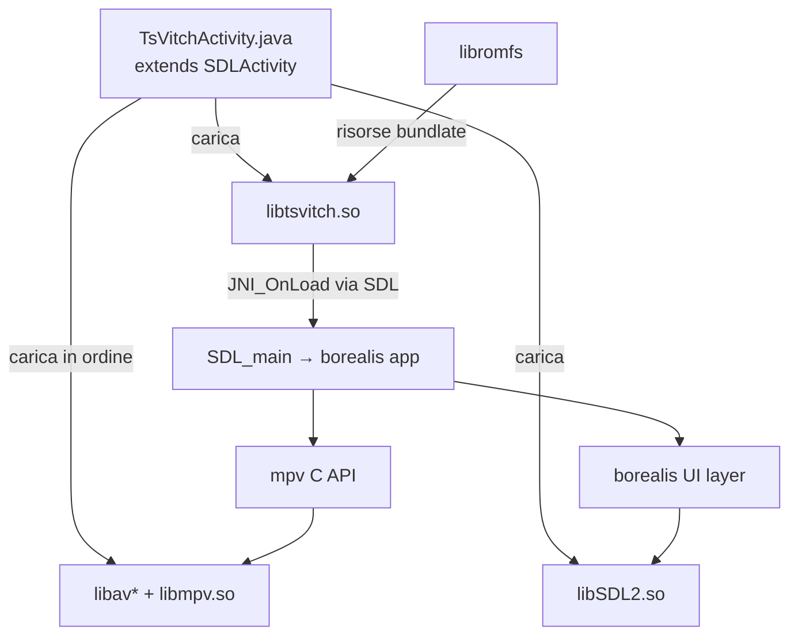

# Design Document: Android Support

## Overview

Questo documento descrive il design tecnico per il porting di TsVitch su Android. L'approccio segue il pattern già adottato da borealis nel suo progetto demo Android: la libreria nativa viene compilata come shared library tramite JNI, SDL2 funge da backend multimediale/input, e le risorse vengono bundlate con libromfs.

Il progetto Android (`android-project/`) viene creato nella root di TsVitch, adattando la struttura del demo borealis. La differenza principale rispetto al demo è l'integrazione di libmpv (precompilato per Android) per la riproduzione video, e la necessità di passare `SERVER_URL` e `SERVER_TOKEN` come parametri CMake obbligatori.

### Flusso di build

```
Host: compila libromfs-generator (nativo)
  ↓
Gradle invoca CMake (NDK cross-compile)
  ↓
JNI CMakeLists.txt:
  - aggiunge SDL2 (subdirectory)
  - imposta PLATFORM_ANDROID=ON
  - include CMakeLists.txt root TsVitch (add_subdirectory)
    ↓
    TsVitch CMakeLists.txt:
      - linka libmpv precompilate da android-project/app/libs/${ANDROID_ABI}/
      - aggiunge -DMPV_SW_RENDER -DMPV_NO_FB
      - program_target() → add_library(tsvitch SHARED ...)
  ↓
Output: libtsvitch.so + libSDL2.so
  ↓
APK: libtsvitch.so + libSDL2.so + libmpv.so + libav*.so
  ↓
TsVitchActivity.java carica le .so nell'ordine corretto
```

---

## Architecture



### Componenti principali

| Componente | Ruolo |
|---|---|
| `TsVitchActivity.java` | Entry point Android, carica le .so nell'ordine corretto |
| `android-project/app/jni/CMakeLists.txt` | JNI build entry point, orchestra la compilazione |
| `CMakeLists.txt` (root) | Build principale TsVitch, adattato per `PLATFORM_ANDROID` |
| `libmpv` precompilate | Riproduzione video (arm64-v8a, armeabi-v7a) |
| `libromfs-generator` | Converte le risorse in C++ da linkare nel binario |
| `scripts/build_android.sh` | Script di build automatizzato |

---

## Components and Interfaces

### 1. Struttura directory `android-project/`

```
android-project/
├── app/
│   ├── build.gradle                    ← config Gradle app
│   ├── proguard-rules.pro
│   ├── jni/
│   │   ├── CMakeLists.txt              ← JNI entry point CMake
│   │   ├── SDL/                        ← symlink → library/borealis/library/lib/extern/SDL
│   │   ├── tsvitch/                    ← symlink → . (root TsVitch)
│   │   └── mpv/
│   │       └── include/
│   │           └── mpv/                ← header C di mpv (client.h, render.h, ...)
│   ├── libs/
│   │   ├── arm64-v8a/                  ← .so precompilate mpv+ffmpeg
│   │   │   ├── libmpv.so
│   │   │   ├── libavcodec.so
│   │   │   ├── libavformat.so
│   │   │   ├── libavutil.so
│   │   │   ├── libswresample.so
│   │   │   ├── libswscale.so
│   │   │   └── libavfilter.so
│   │   └── armeabi-v7a/                ← stesse .so per armeabi-v7a
│   └── src/main/
│       ├── AndroidManifest.xml
│       ├── java/com/giovannimirulla/tsvitch/
│       │   └── TsVitchActivity.java
│       └── res/
│           ├── mipmap-*/ic_launcher.png
│           └── values/strings.xml
├── build.gradle                        ← top-level Gradle
├── settings.gradle
├── gradle.properties                   ← SERVER_URL, SERVER_TOKEN passati a CMake
├── gradlew
└── gradlew.bat
```

### 2. JNI CMakeLists.txt (`android-project/app/jni/CMakeLists.txt`)

Responsabilità:
- Imposta `PLATFORM_ANDROID=ON` e `BUILD_SHARED_LIBS=ON`
- Aggiunge SDL2 come subdirectory
- Verifica la presenza di `libromfs-generator` (FATAL_ERROR se assente)
- Verifica `SERVER_URL` e `SERVER_TOKEN` (FATAL_ERROR se assenti)
- Verifica la presenza delle `.so` di libmpv in `libs/${ANDROID_ABI}/`
- Include il CMakeLists.txt root di TsVitch via `add_subdirectory`

### 3. TsVitchActivity.java

Estende `SDLActivity` (da SDL2). Responsabilità:
- `getLibraries()`: ordine di caricamento delle .so (avutil → swresample → avcodec → avformat → swscale → avfilter → mpv → SDL2 → tsvitch)
- `onCreate()`: inizializza `PlatformUtils.borealisHandler`
- `onDestroy()`: chiama `System.exit(0)` per evitare problemi con le variabili statiche di borealis

### 4. Aggiornamento `CMakeLists.txt` root

Aggiunge un blocco `PLATFORM_ANDROID` che:
- Linka le `.so` precompilate da `${CMAKE_SOURCE_DIR}/android-project/app/libs/${ANDROID_ABI}/`
- Aggiunge gli include path per gli header mpv
- Aggiunge `-DMPV_SW_RENDER` e `-DMPV_NO_FB` alle opzioni di compilazione

### 5. `scripts/build_android.sh`

Script bash che:
1. Verifica `SERVER_URL` e `SERVER_TOKEN` come variabili d'ambiente
2. Compila `libromfs-generator` per l'host
3. Copia il generatore in `android-project/app/jni/tsvitch/`
4. Scrive `SERVER_URL` e `SERVER_TOKEN` in `gradle.properties`
5. Invoca `./gradlew assembleRelease`

---

## Data Models

### Parametri CMake passati via Gradle

`gradle.properties` (generato dallo script di build):
```properties
SERVER_URL=https://example.com
SERVER_TOKEN=mytoken
```

`app/build.gradle` li passa a CMake:
```groovy
cmake {
    arguments "-DSERVER_URL=${SERVER_URL}", "-DSERVER_TOKEN=${SERVER_TOKEN}", ...
}
```

### Ordine di caricamento librerie (TsVitchActivity)

L'ordine è critico: ogni libreria deve essere caricata dopo le sue dipendenze.

```
avutil → swresample → avcodec → avformat → swscale → avfilter → mpv → SDL2 → tsvitch
```

`tsvitch` è l'ultima perché dipende da tutte le altre. SDL2 deve precedere tsvitch perché SDL_main è il punto di ingresso.

### Struttura `.so` precompilate

Fonte: [mpv-android releases](https://github.com/mpv-android/mpv-android/releases)

Per ogni ABI (`arm64-v8a`, `armeabi-v7a`):
- `libmpv.so` — player mpv
- `libavcodec.so`, `libavformat.so`, `libavutil.so` — FFmpeg core
- `libswresample.so`, `libswscale.so` — FFmpeg scaling/resampling
- `libavfilter.so` — FFmpeg filters

---

## Correctness Properties

*A property is a characteristic or behavior that should hold true across all valid executions of a system — essentially, a formal statement about what the system should do. Properties serve as the bridge between human-readable specifications and machine-verifiable correctness guarantees.*

### Property 1: Validazione parametri obbligatori

*For any* invocazione del JNI CMakeLists.txt o dello script di build senza `SERVER_URL` o `SERVER_TOKEN`, il sistema SHALL terminare con un errore esplicito e non produrre output parziali.

**Validates: Requirements 4.5, 4.7, 7.1, 7.2**

### Property 2: Verifica presenza libromfs-generator

*For any* tentativo di build Android, se il file `libromfs-generator` non è presente nel percorso atteso, il sistema SHALL terminare con `FATAL_ERROR` prima di procedere con la compilazione.

**Validates: Requirements 4.3, 4.4**

### Property 3: Verifica presenza .so libmpv

*For any* ABI target configurata (`arm64-v8a`, `armeabi-v7a`), se le `.so` di libmpv non sono presenti in `android-project/app/libs/${ANDROID_ABI}/`, il sistema SHALL terminare con un messaggio di errore che indica il percorso atteso.

**Validates: Requirements 6.5**

### Property 4: Ordine caricamento librerie

*For any* avvio dell'applicazione Android, le librerie native SHALL essere caricate nell'ordine: avutil, swresample, avcodec, avformat, swscale, avfilter, mpv, SDL2, tsvitch — garantendo che ogni libreria sia disponibile prima delle sue dipendenti.

**Validates: Requirements 2.2**

---

## Error Handling

### Errori di build (CMake / Gradle)

| Condizione | Comportamento |
|---|---|
| `SERVER_URL` non definito | `FATAL_ERROR` in JNI CMakeLists.txt con messaggio esplicito |
| `SERVER_TOKEN` non definito | `FATAL_ERROR` in JNI CMakeLists.txt con messaggio esplicito |
| `libromfs-generator` assente | `FATAL_ERROR` con path atteso e riferimento a `build_libromfs_generator.sh` |
| `.so` libmpv assenti | `FATAL_ERROR` con path atteso e riferimento a mpv-android releases |

### Errori di build (script bash)

| Condizione | Comportamento |
|---|---|
| `SERVER_URL` non esportato | `exit 1` con messaggio "SERVER_URL is required" |
| `SERVER_TOKEN` non esportato | `exit 1` con messaggio "SERVER_TOKEN is required" |
| Compilazione `libromfs-generator` fallita | `set -e` propaga l'errore |
| `gradlew assembleRelease` fallito | `set -e` propaga l'errore |

### Errori a runtime (Android)

| Condizione | Comportamento |
|---|---|
| `.so` non trovata al caricamento | Android lancia `UnsatisfiedLinkError` — l'app non si avvia |
| Crash borealis al riavvio | `System.exit(0)` in `onDestroy()` previene problemi con variabili statiche |

---

## Testing Strategy

### Approccio

Questo feature riguarda principalmente la configurazione del build system (Gradle, CMake), file di progetto Android, e script bash. Non ci sono funzioni pure con input/output arbitrari su cui applicare property-based testing in modo significativo.

Le proprietà di correttezza identificate (validazione parametri, verifica file, ordine librerie) sono meglio verificate con:

- **Test di integrazione / smoke test**: verificare che la build si completi con parametri validi
- **Test di errore (example-based)**: verificare che la build fallisca con messaggi corretti quando mancano parametri o file
- **Test manuale**: installazione e avvio dell'APK su dispositivo/emulatore

### Test consigliati

#### 1. Build smoke test
```bash
# Verifica che la build completa funzioni con parametri validi
export SERVER_URL="https://test.example.com"
export SERVER_TOKEN="testtoken"
bash scripts/build_android.sh
# Atteso: APK generato in android-project/app/build/outputs/apk/release/
```

#### 2. Validazione parametri mancanti
```bash
# Verifica exit code non-zero senza SERVER_URL
unset SERVER_URL
export SERVER_TOKEN="testtoken"
bash scripts/build_android.sh
# Atteso: exit 1, messaggio "SERVER_URL is required"

# Verifica exit code non-zero senza SERVER_TOKEN
export SERVER_URL="https://test.example.com"
unset SERVER_TOKEN
bash scripts/build_android.sh
# Atteso: exit 1, messaggio "SERVER_TOKEN is required"
```

#### 3. Verifica libromfs-generator mancante
```bash
# Rimuovere il generatore e verificare FATAL_ERROR CMake
rm android-project/app/jni/tsvitch/libromfs-generator
# Avviare build Gradle → CMake deve terminare con FATAL_ERROR
```

#### 4. Test su dispositivo
- Installare APK su dispositivo arm64-v8a (es. Pixel 6)
- Installare APK su dispositivo armeabi-v7a (es. dispositivo Android 5.0 32-bit)
- Verificare avvio, riproduzione video, navigazione UI

### Nota su PBT

Property-based testing non è appropriato per questo feature perché:
- Il build system (CMake/Gradle) è configurazione dichiarativa, non logica con input/output variabili
- Le proprietà di correttezza sono verifiche di presenza/assenza di file e parametri (smoke/integration test)
- Non ci sono funzioni pure con spazio di input ampio da esplorare con generatori casuali
